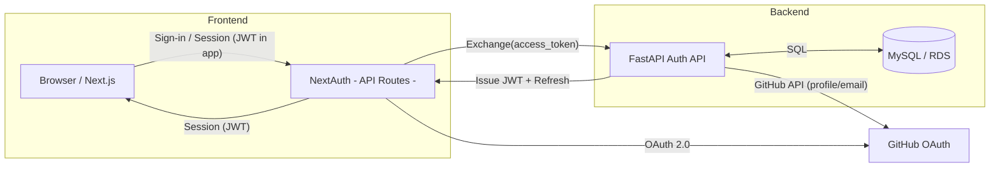
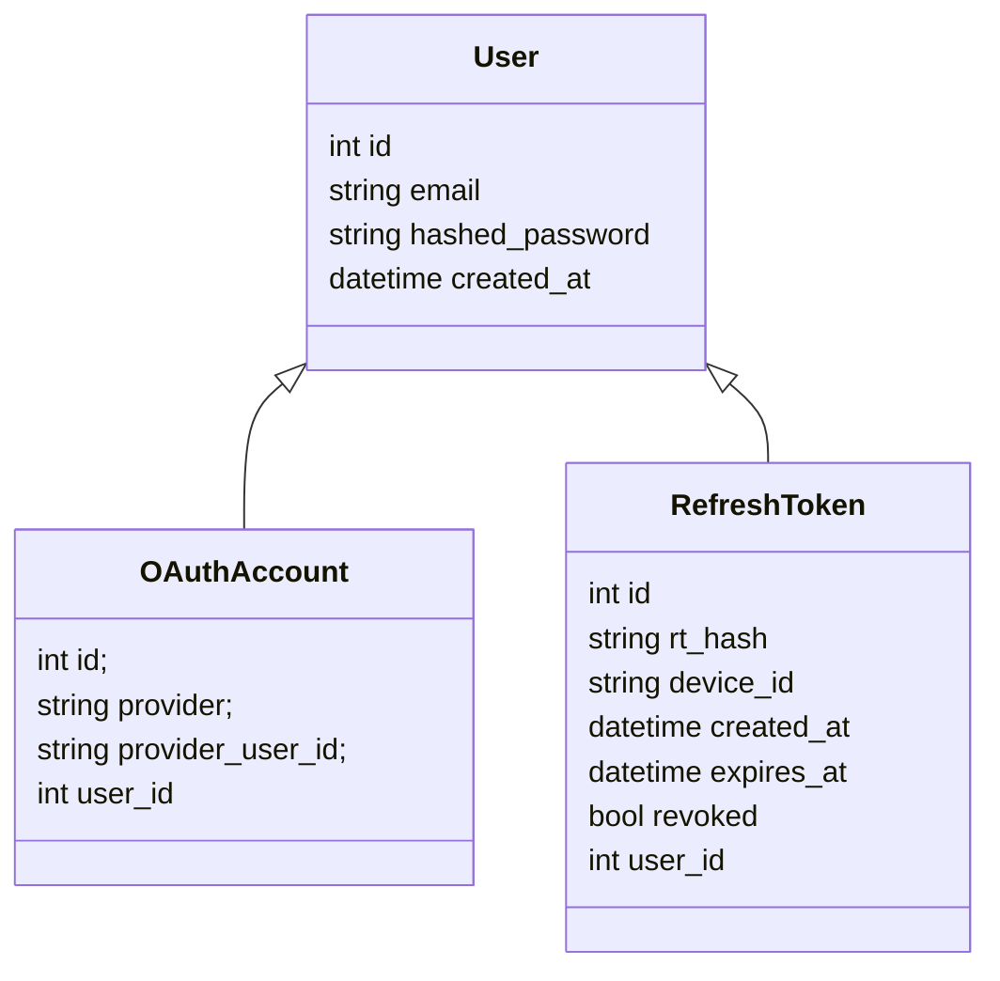
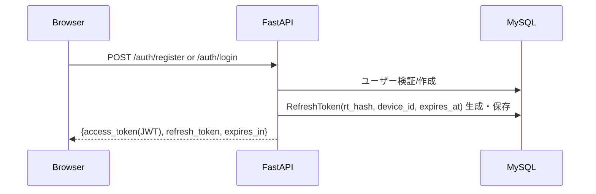
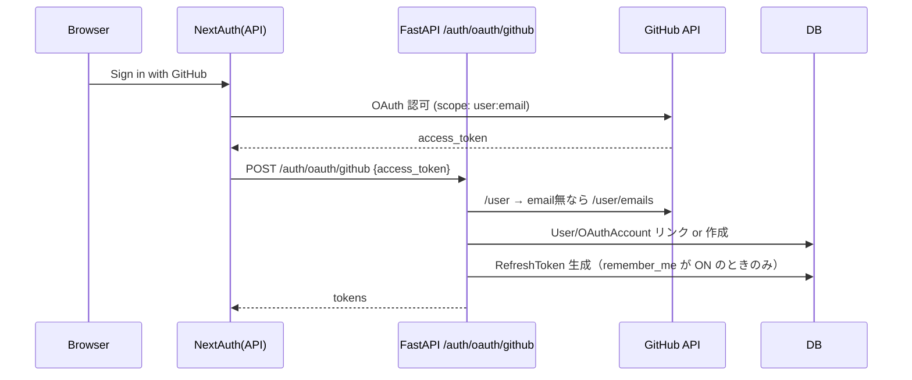
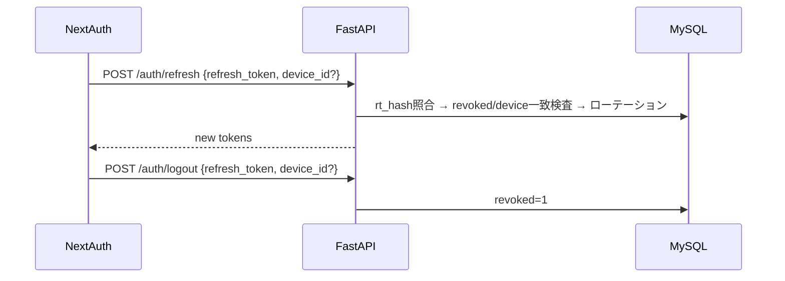
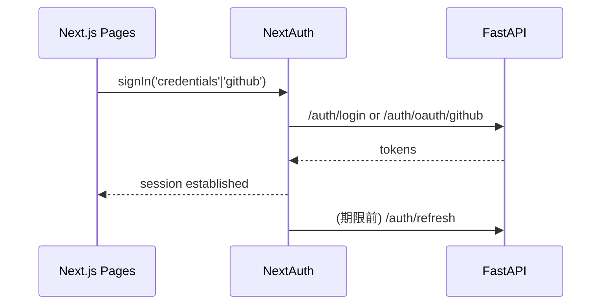

# 認証・認可 基本設計（概要)

本書は、資金調達向けに「分かりやすさ」を重視してまとめた認証・認可の基本設計です。実装詳細はリポジトリに準拠します。

---

## 1. コンセプトと価値
- 安全でシンプル: パスワード認証と GitHub OAuth。
- モダン体験: Next.js + NextAuth と FastAPI による軽快な UX。
- 運用容易: アクセストークンは JWT、リフレッシュは不透明トークンで安全にローテーション。

---

## 2. システム構成（高レベル）
- フロントエンド: Next.js + NextAuth
- バックエンド: FastAPI（Auth API）
- データベース: MySQL（ユーザー、OAuth アカウント、リフレッシュトークン）

要点（役割の切り分け）
- NextAuth: GitHub とのOAuth認可（リダイレクト/同意/`access_token`受領）
- FastAPI: 受領した`access_token`でGitHubのユーザー/メールAPIを呼び出し、アカウント連携とJWT/Refreshを発行

---

## 3. ドメインモデル（要点）
- User: email, hashed_password, created_at
- OAuthAccount: provider, provider_user_id（User と 1:N）
- RefreshToken: rt_hash(ユニーク, SHA-256), user_id, device_id, created_at, expires_at, revoked（ローテーション/論理削除）

---

## 4. バックエンドのフロー（FastAPI）

### 4.1 新規登録 / ログイン（Credentials）
- 入力: email, password, device_id（任意）, remember_me（既定ON）
- 登録: 既存チェック → bcrypt ハッシュ → 作成
- ログイン: bcrypt 検証
- Remember me（既定ON）: ON の場合のみリフレッシュトークンを発行（OFF の場合はアクセストークンのみ）
- 発行: JWT アクセストークン +（必要に応じて）不透明リフレッシュトークン（DBには rt_hash を保存）

### 4.2 GitHub OAuth 連携
- Authlib の OAuth2Client でトークン取得・ユーザー/メール取得。
- メールが取得できない場合は 400（ユーザー作成を拒否）。

### 4.3 トークンリフレッシュ / ログアウト
- Refresh: `rt_hash=SHA256(rt)` で照合 → revoked=1 は“流出検知”として同ユーザー全RTを revoked=1 にし拒否 → device_id が両方揃って不一致なら同様に全RTを revoked=1 → 有効なら旧RTを revoked=1 にし新RTを発行（ローテーション）。
- Logout: 対象リフレッシュトークンを revoked=1（論理削除, 冪等）。

---

## 5. フロントエンドのフロー（Next.js + NextAuth）
- セッション: NextAuth の JWT 戦略。初回ログインで受領した tokens を保持し、期限前に自動リフレッシュ。
- device_id 配布: 初回アクセス時にブラウザで生成し、localStorage と Cookie の双方に保存（API Route でも参照可能）。各 API 呼び出しにヘッダ `X-Device-Id` として付与、またはボディに送信。
- プロバイダ:
  - Credentials: `/auth/login` に委譲。
  - GitHub: 既に承認済みなら GitHub 画面をスキップ。失敗時は詳細メッセージを表示し、必要時のみ再同意導線を表示。
- Remember me:
  - 登録/ログイン画面にチェックボックス（既定ON）
  - 値は Cookie `remember_me` にも保存し、NextAuth(API) から参照して OAuth でも反映
- サインアウト: NextAuth の `events.signOut` で `/auth/logout` を呼び出し、当該端末の RT を revoked=1。
- 管理画面: `/sessions` から「全端末ログアウト」→ `/auth/logout_all` を叩き、全RTを revoked=1。

---

## 6. セキュリティ設計（抜粋）
- パスワード: passlib[bcrypt]（bcrypt 3.2 系と互換）
- アクセストークン: JWT(HS256)、短寿命、`sub` と `exp` を含む。
- リフレッシュ: `secrets.token_urlsafe(48)` の高エントロピー不透明トークン。DB には SHA-256 の `rt_hash` を保存（平文は保持しない）。device_id と結びつけ、流出や不一致検知で全セッション無効化。
- CORS: 環境変数で許可ドメインを制御。
- OAuth: Authlib で安全にトークン取得、メール未取得時は 400。
- 異常検知: revoked トークンの使用や device 不一致時に警告ログ（user_id, device_id, IP）を出力。

---

## 7. 環境と運用（要点）
- URL と CORS、DB は環境変数で切替（develop / staging / production）。
- ステージング/本番: Amplify（Front）/ ECS+ALB（Back）/ RDS（DB）。
- マイグレーション: 起動時に `alembic upgrade head`。

---

## 8. 主要 API（摘要）
- POST `/auth/register` — Remember me=true で RT 発行、device_id を保存
- POST `/auth/login` — device_id を保存
- POST `/auth/oauth/github` — device_id を保存（Cookie/ヘッダ/ボディ）
- POST `/auth/refresh` — rt_hash 照合、device 一致検査、ローテーション
- POST `/auth/logout` — 端末単位で revoked=1
- POST `/auth/logout_all` — ユーザー全 RT を revoked=1（要認証）
- GET `/users/me`

---

## 9. 投資観点のまとめ
- シンプル設計で短期間の実装と長期の保守性を両立。
- 標準技術スタックにより人材確保が容易で、運用コストも読みやすい。
- 安全なトークン運用（JWT + 不透明リフレッシュ + ローテーション）でリスク低減。
