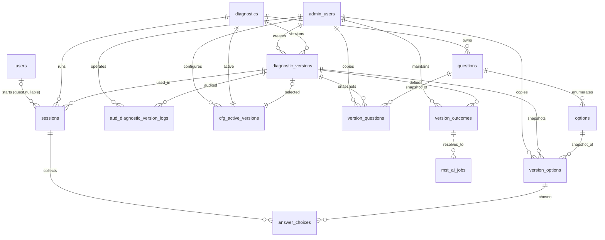

# AI職種診断（Option→Facet→MstAiJob）設計書（統合版・確定）

## 0. 前提・ポリシー

* **RDB**: MySQL 8.0 / InnoDB / `utf8mb4` / `utf8mb4_0900_ai_ci`
* **命名**: 小文字 `snake_case`、テーブルは**複数形**、列は**単数形**、PK は `id`、FK は `<entity>_id` ルール準拠
* **時刻**: `created_at`/`updated_at`（必要テーブルのみ）。`updated_at` はアプリ側で更新
* **論理削除**: 当面なし。履歴は監査系テーブルで担保（論理削除フラグは設けない）
* **外部キーの方針**: 設計上は **RESTRICT** を基本（バージョンや回答は後から消せない前提）
* **UK/INDEX**: コード系は `diagnostic_id` スコープで **UK**、集計/検索で使う列に **BTREE INDEX** を明示
* **Outcome の汎用化**: `outcome_table_name` + `outcome_id` で多型参照（本設計では `mst_ai_jobs` を主対象）

---

## 1. ER 図（Mermaid）

---

## 2. テーブル定義（DDL仕様）

> ここでの型は MySQL 8.0 想定。`varchar` は文字数の目安。`created_at`/`updated_at` はアプリで管理。
> すべて `ENGINE=InnoDB DEFAULT CHARSET=utf8mb4 COLLATE=utf8mb4_0900_ai_ci`。

### 2.1 users
* **description**:  
  ユーザーの管理（パスワード or OAuth）

* **columns**:
  - `id BIGINT PK AI`
  - `email VARCHAR(191) NOT NULL`
  - `hashed_password TEXT NULL`   ← OAuth専用ユーザーを許容
  - `created_at DATETIME NOT NULL`

* **constraints**:
  - `UK users_email (email)`

* **indexes**:
  - `(email)`（UK兼用）

### 2.2 admin_users
* **description**:  
  管理者ユーザーの管理

* **columns**:
  - `id BIGINT PK AI`
  - `user_id VARCHAR(64) NOT NULL`
  - `display_name VARCHAR(191) NULL`
  - `hashed_password TEXT NOT NULL`
  - `is_active BOOL TRUE`
  - `created_at DATETIME NOT NULL`
  - `updated_at DATETIME NOT NULL`

* **constraints**:
  - `UK admin_user_id (user_id)`

* **indexes**:
  - `(user_id)`（UK兼用）

### 2.3 diagnostics
* **description**:
  診断種類の管理
  参照マスタテーブル(outcome_table_name)はバックエンド側で解決する

* **columns**:

  * `id BIGINT PK AI`
  * `code VARCHAR(64) NOT NULL`
  * `description TEXT`
  * `outcome_table_name VARCHAR(64) NOT NULL` --参照するマスタテーブル正式名称
  * `is_active BOOLEAN NOT NULL DEFAULT TRUE`
  * `created_at DATETIME NOT NULL`
  * `updated_at DATETIME NOT NULL`
* **constraints**:

  * `UK diagnostics_code (code)`
* **indexes**:

  * `(code)`

### 2.4 diagnostic_versions
* **description**:
  各診断のプロンプト・質問/選択肢スナップショットのバージョン履歴を管理（公開中バージョンは別テーブルで管理）
* **columns**:

  * `id BIGINT PK AI`
  * `diagnostic_id BIGINT NOT NULL`
  * `name VARCHAR(128) NOT NULL`
  * `description TEXT NULL`
  * `system_prompt TEXT NULL`
  * `src_hash VARCHAR(128) NULL` -- 版に紐づく`version_questions, version_options, system_prompt`を足し合わせハッシュ化する(監査的な意味)
  * `note TEXT NULL`
  * `created_by_admin_id BIGINT NOT NULL`
  * `updated_by_admin_id BIGINT NOT NULL`
  * `created_at DATETIME NOT NULL`
  * `updated_at DATETIME NOT NULL`
* **constraints**:

  * `FK (diagnostic_id) -> diagnostics(id) ON DELETE RESTRICT`
  * `FK (created_by_admin_id) -> admin_users(id) ON DELETE RESTRICT`
  * `FK (updated_by_admin_id) -> admin_users(id) ON DELETE RESTRICT`
  * `UK diagnostic_versions_diagnostic_name (diagnostic_id, name)`
* **indexes**:

  * `IDX diagnostic_versions_diagnostic (diagnostic_id, id)`
  * `IDX diagnostic_versions_created_by (created_by_admin_id)`
  * `IDX diagnostic_versions_updated_by (updated_by_admin_id)`

### 2.5 aud_diagnostic_version_logs
* **description**:  
  管理者が `diagnostic_versions` に対して行った操作ログを管理（作成・更新・削除の履歴を保持）

* **columns**:
  * `id BIGINT PK AI`
  * `version_id BIGINT NOT NULL`
  * `admin_user_id BIGINT NOT NULL`
  * `action VARCHAR(32) NOT NULL` -- 例: 'CREATE', 'UPDATE', 'DELETE', 'RESTORE'
  * `field_name VARCHAR(64) NULL` -- 更新対象のカラム名（全体操作ならNULL）
  * `old_value TEXT NULL`
  * `new_value TEXT NULL`
  * `note TEXT NULL`
  * `created_at DATETIME NOT NULL`

* **constraints**:
  * `FK (version_id) -> diagnostic_versions(id) ON DELETE RESTRICT`
  * `FK (admin_user_id) -> admin_users(id) ON DELETE RESTRICT`

* **indexes**:
  * `IDX aud_cdv_logs_version (version_id, created_at)`
  * `IDX aud_cdv_logs_admin (admin_user_id, created_at)`

### 2.6 cfg_active_versions
* **description**:  
  現時点でアクティブな各診断のバージョンを管理（1診断につき必ず1つだけ存在する）

* **columns**:
  * `id BIGINT PK AI`
  * `diagnostic_id BIGINT NOT NULL`
  * `version_id BIGINT NOT NULL`
  * `created_by_admin_id BIGINT NOT NULL`
  * `updated_by_admin_id BIGINT NOT NULL`
  * `created_at DATETIME NOT NULL`
  * `updated_at DATETIME NOT NULL`

* **constraints**:
  * `FK (diagnostic_id) -> diagnostics(id) ON DELETE RESTRICT`
  * `FK (version_id) -> diagnostic_versions(id) ON DELETE RESTRICT`
  * `FK (created_by_admin_id) -> admin_users(id) ON DELETE RESTRICT`
  * `FK (updated_by_admin_id) -> admin_users(id) ON DELETE RESTRICT`
  * `UK cfg_active_versions_scope (diagnostic_id)`

* **indexes**:
  * NONE

### 2.7 sessions
* **description**:  
  1診断結果が、どの診断で、どのユーザーが、どのバージョンのsystemプロンプトを使用したのかを管理する
  なお、公開終了日も管理する

* **columns**:

  * `id BIGINT PK AI`
  * `user_id BIGINT NULL`（未ログイン利用を許容）
  * `session_code VARCHAR(64) NOT NULL`
  * `diagnostic_id BIGINT NOT NULL`
  * `version_id BIGINT NOT NULL`
  * `llm_result JSON NULL` -- LLMの回答結果を保存
  * `version_options_hash VARCHAR(128) NOT NULL` -- 診断versionとユーザー選択肢をハッシュ化して保存(既に生成済みの組み合わせは結果を流用する)
  * `ended_at DATETIME NULL`
  * `created_at DATETIME NOT NULL`
  * `updated_at DATETIME NOT NULL`
* **constraints**:

  * `FK (user_id) -> users(id) ON DELETE RESTRICT`
  * `FK (diagnostic_id) -> diagnostics(id) ON DELETE RESTRICT`
  * `FK (version_id) -> diagnostic_versions(id) ON DELETE RESTRICT`
  * `UK sessions_session_code (session_code)`
* **indexes**:

  * `IDX sessions_user (user_id)`
  * `IDX sessions_diagnostic_version (diagnostic_id, version_id)`
  * `IDX sessions_ended_at (ended_at)`

### 2.8 questions
* **description**: 
  質問カタログ（下書き/公開候補）。versionごとの出題は別テーブルで制御。

* **columns**:
  * `id BIGINT PK AI`
  * `diagnostic_id BIGINT NOT NULL`
  * `q_code VARCHAR(64) NOT NULL`
  * `display_text VARCHAR(1000) NOT NULL`
  * `multi BOOLEAN NOT NULL DEFAULT FALSE`
  * `sort_order INT NOT NULL`
  * `is_active BOOLEAN NOT NULL DEFAULT FALSE` --「カタログとしての有効/無効」を表す（版とは切り離す）
  * `created_at DATETIME NOT NULL`
  * `updated_at DATETIME NOT NULL`
* **constraints**:
  * `UK questions_code (diagnostic_id, q_code)`
  * `FK (diagnostic_id) -> diagnostics(id) ON DELETE RESTRICT`
* **indexes**:

  * `IDX idx_questions_diagnostic_active_sort (diagnostic_id, is_active, sort_order, id)`

### 2.9 version_questions
* **description**:
  指定 `version_id` で出題する質問集合を制御し、版ごとの文言・設問設定を固定化するスナップショット。

  原則：version_questions に入っているものだけ、その version で出題。
    自動初期化（推奨）：版生成時に

  - `questions` カタログの `q_code` / `display_text` / `multi` / `sort_order` / `is_active` をコピーし、版内での文言修正や一時的な非表示に対応。

* **columns**:
  * `id BIGINT PK AI`
  * `version_id BIGINT NOT NULL`
  * `diagnostic_id BIGINT NOT NULL` -- 版に紐づく診断ID（`diagnostic_versions.diagnostic_id` をコピー）
  * `question_id BIGINT NOT NULL`
  * `q_code VARCHAR(64) NOT NULL`
  * `display_text VARCHAR(1000) NOT NULL`
  * `multi BOOLEAN NOT NULL DEFAULT FALSE`
  * `sort_order INT NOT NULL` -- 版ごとの出題順
  * `is_active BOOLEAN NOT NULL DEFAULT TRUE`
  * `created_by_admin_id BIGINT NOT NULL`
  * `created_at DATETIME NOT NULL`
  * `updated_at DATETIME NOT NULL`

* **constraints**:
  * `UK (version_id, question_id)`
  * `FK (version_id)        -> diagnostic_versions(id) ON DELETE RESTRICT`
  * `FK (diagnostic_id)     -> diagnostics(id) ON DELETE RESTRICT`
  * `FK (question_id)       -> questions(id) ON DELETE RESTRICT`
  * `FK (created_by_admin_id) -> admin_users(id) ON DELETE RESTRICT`

* **indexes**:
  * `IDX version_questions_sort (version_id, sort_order, question_id)`
  * `IDX version_questions_active (version_id, is_active, sort_order)`

### 2.10 options

* **columns**:
  * `id BIGINT PK AI`
  * `question_id BIGINT NOT NULL`
  * `opt_code VARCHAR(64) NOT NULL`
  * `display_label VARCHAR(500) NOT NULL`
  * `llm_op JSON NULL` -- この質問をLLMはどういう観点で評価するのかの指示
  * `sort_order INT NOT NULL`
  * `is_active BOOLEAN NOT NULL DEFAULT TRUE`
  * `created_at DATETIME NOT NULL`
  * `updated_at DATETIME NOT NULL`
* **constraints**:
  * `UK options_code (question_id, opt_code)`
  * `FK (question_id) -> questions(id) ON DELETE RESTRICT`
  * `UK options_question_sort (question_id, sort_order)`
* **indexes**:

  * `IDX idx_options_question_sort_id(question_id, sort_order, id)`

### 2.11 version_options
* **description**:
  指定 `version_id` で出題する **選択肢集合** を制御（= 選択肢のアクティベーションを版ごとに固定）

  並び順は options.sort_order を初期値にコピーし、version_options.sort_order で版ごとに固定。

  - `options` カタログの `opt_code` / `display_label` / `sort_order` / `is_active` をコピーし、版内での文言修正や一時的な非表示に対応。
  - `version_question_id` で `version_questions` のスナップショット行にぶら下がる。

* **columns**:
  * `id BIGINT PK AI`
  * `version_id BIGINT NOT NULL`
  * `version_question_id BIGINT NOT NULL`
  * `option_id BIGINT NOT NULL`
  * `opt_code VARCHAR(64) NOT NULL`
  * `display_label VARCHAR(500) NOT NULL`
  * `llm_op JSON NULL` -- この質問をLLMはどういう観点で評価するのかの指示
  * `sort_order INT NOT NULL` -- 版ごとの選択肢表示順
  * `is_active BOOLEAN NOT NULL DEFAULT TRUE`
  * `created_by_admin_id BIGINT NOT NULL`
  * `created_at DATETIME NOT NULL`
  * `updated_at DATETIME NOT NULL`

* **constraints**:
  * `UK (version_id, version_question_id, opt_code)`
  * `FK (version_id) -> diagnostic_versions(id) ON DELETE RESTRICT`
  * `FK (version_question_id) -> version_questions(id) ON DELETE RESTRICT`
  * `FK (option_id) -> options(id) ON DELETE RESTRICT`
  * `FK (created_by_admin_id) -> admin_users(id) ON DELETE RESTRICT`

* **indexes**:
  * `IDX version_options_sort (version_id, version_question_id, sort_order)`
  * `IDX version_options_active (version_id, is_active, version_question_id, sort_order)`

### 2.12 mst_ai_jobs
* **description**:  
  AI職種のマスタ

* **columns**:

  * `id BIGINT PK AI`
  * `name VARCHAR(191) NOT NULL`
  * `category VARCHAR(191) NULL` -- 職種カテゴリ（例: 戦略・経営系）
  * `role_summary TEXT NOT NULL` -- 要約（ハイライト）
  * `main_role TEXT NULL` -- 主な役割・業務範囲
  * `collaboration_style TEXT NULL` -- 関係者との関わり方
  * `strength_areas TEXT NULL` -- 強みが求められる領域
  * `description TEXT NOT NULL` -- 職種の特徴・詳細解説
  * `avg_salary_jpy VARCHAR(64) NULL` -- 表記に合わせた年収レンジ文字列
  * `target_phase TEXT NULL` -- 担当する顧客/事業フェーズ
  * `core_skills TEXT NULL` -- 必要スキル
  * `deliverables TEXT NULL` -- 主な成果物
  * `pathway_detail TEXT NULL` -- キャリアパス
  * `ai_tools TEXT NULL` -- よく使うAIツール
  * `advice TEXT NULL` -- 目指す人へのアドバイス
  * `is_active BOOLEAN NOT NULL DEFAULT TRUE`
  * `sort_order INT NOT NULL DEFAULT 0`
  * `created_at DATETIME NOT NULL`
  * `updated_at DATETIME NOT NULL`
* **constraints**:

  * `UK mst_ai_jobs_name (name)`
* **indexes**:

  * NONE

### 2.13 version_outcomes
* **description**:  
  バージョンごとの Outcome 集合と表示用メタ情報（LLM推奨結果の整形に利用）を固定する。

* **columns**:
  * `id BIGINT PK AI`
  * `version_id BIGINT NOT NULL`
  * `outcome_id BIGINT NOT NULL`    -- 元マスタのID
  * `outcome_meta_json JSON NULL`   -- マスタ列差異を吸収するためのメタ（表示用）。例: mst_ai_jobs の主要列をJSONで保持
  * `sort_order INT NOT NULL DEFAULT 0`
  * `is_active TINYINT(1) NOT NULL DEFAULT 1`
  * `created_by_admin_id BIGINT NOT NULL`
  * `created_at DATETIME NOT NULL`
  * `updated_at DATETIME NOT NULL`

* **constraints**:
  * `UK (version_id, outcome_id)`
  * `FK (version_id) -> diagnostic_versions(id) ON DELETE RESTRICT`
  * `FK (created_by_admin_id) -> admin_users(id) ON DELETE RESTRICT`

* **indexes**:
  * `IDX version_outcomes_sort (version_id, sort_order, outcome_id)`

### 2.14 answer\_choices
* **description**:  
  1診断(session)ごとにユーザーが回答した選択肢を管理する(ユーザーとの紐付けはsessionsと結合する)

* **columns**:

  * `id BIGINT PK AI`
  * `session_id BIGINT NOT NULL`
  * `version_option_id BIGINT NOT NULL`
  * `answered_at DATETIME NOT NULL`
* **constraints**:

  * `FK (session_id) -> sessions(id) ON DELETE RESTRICT`
  * `FK (version_option_id) -> version_options(id) ON DELETE RESTRICT`
  * `UK answer_choices_once (session_id, version_option_id)`
* **indexes**:

  * `IDX answer_choices_session (session_id)`

---

## 3. インデックス／UK 戦略（要点）

* **コード系の一意**:

  * `diagnostics.code`、`questions(q_code)`、`options(opt_code)` は **診断スコープ**で UK
* **アクティブ版の固定**:

  * `cfg_active_versions(diagnostic_id)` を UK（診断ごとに1つの有効版）

* **回答一意性**:

  * `answer_choices(session_id, version_option_id)` を UK（多重回答の重複抑止）
* **参照頻度の高いFKにBTREE**:

  * `sessions(diagnostic_id, version_id)` など、結合キーに複合INDEX

---

## 4. 参照・整合性ポリシー

* **版（diagnostic_versions）**は**freezeされ次第、削除禁止**（`ON DELETE RESTRICT`）
* **options/questions** は **診断IDでスコープ**。再編や名称変更は**新規レコード作成 + 旧は非アクティブ**推奨
* **監査ログ**は**不可逆**（削除運用なし）。ハッシュで投入完全性を担保

---

## 5. データフロー（大筋）

1. **診断版の特定**

   * `cfg_active_versions` から `(diagnostic_id)` に対応する `version_id` を決定
   * セッション開始時に `sessions.version_id` を**固定**

2. **回答取得**

   * 単一選択/複数選択は `answer_choices` へ保存
   * 重複は `UK` により防止

3. **表示**

   * LLM（Frontierモデル）が返したスコア・ランク情報を `sessions.llm_result` に保持
   * レスポンス生成時は `version_outcomes` の表示用メタ (`outcome_meta_json`) と `mst_ai_jobs` 本体を突き合わせ、UI に必要な説明・スキル・キャリアパスを組み立てる
